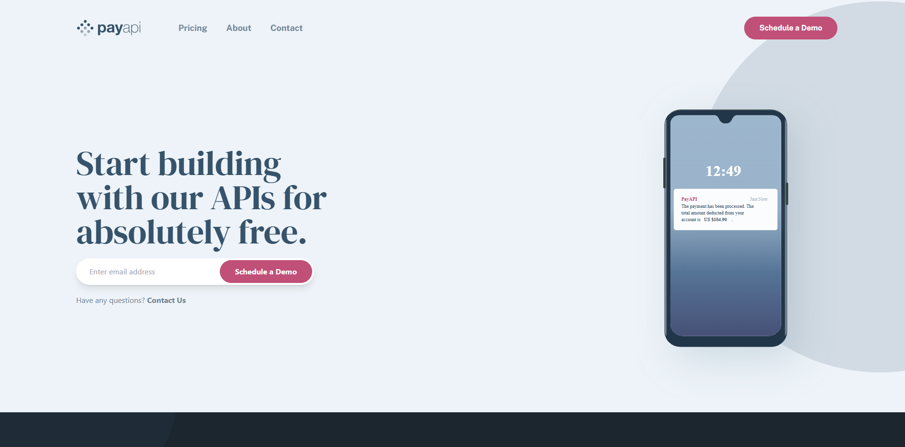

# PayAPI Multi-Page Website


This is a solution to the multi-page website challenge on Frontend Mentor. Frontend Mentor challenges help you improve your coding skills by building realistic projects.

## Table of Contents

- [\[Project Name\] Multi-Page Website](#project-name-multi-page-website)
  - [Table of Contents](#table-of-contents)
  - [Overview](#overview)
    - [The Challenge](#the-challenge)
    - [Screenshot](#screenshot)
    - [Built With](#built-with)
    - [What I Learned](#what-i-learned)

## Overview

### The Challenge

Users should be able to:

- View the optimal layout for each page depending on their device's screen size (Mobile, Tablet, Desktop).
- Navigate between the **Homepage**, **About**, **Pricing**, and **Contact** pages.
- See hover states for all interactive elements throughout the site.
- **Contact Form Validation:** Receive an error message when the form is submitted if:
  - The Name, Email Address, or Message fields are empty (Message: _"This field can't be empty"_).
  - The Email Address is not formatted correctly (Message: _"Please use a valid email address"_).

### Screenshot

**Desktop View**



**Tablet View**


**Mobile View**


### Built With

- **React** - JS Library
- **React Router** - For client-side routing between pages (Home, Pricing, About, Contact)
- **React Hook Form** - For form handling and validation
- **Tailwind CSS** - For utility-first styling and responsive layouts
- **Vite** - Frontend tooling
- Mobile-first workflow

### What I Learned

**1. Multi-Page Routing:**
I used `react-router-dom` to manage the navigation between the Homepage, Pricing, About, and Contact pages, ensuring a smooth Single Page Application (SPA) experience without page reloads.

**2. Custom Form Validation Messages:**
To match the design requirements strictly ("This field can't be empty"), I customized the error messages within the `register` function of React Hook Form.

```jsx
<input
  className={errors.name ? "border-red-500" : "border-white"}
  {...register("name", { required: "This field can't be empty" })}
/>;
{
  errors.name && (
    <span className="text-sm text-red-500 italic">{errors.name.message}</span>
  );
}
```
